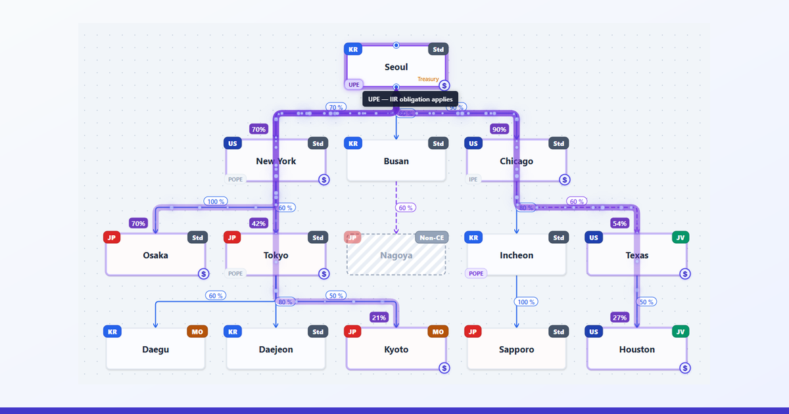

# PillarTwo Architect

**Pillar Two (GloBE Rules) simulator · MNE group structure designer · IIR · UTPR · QDMTT visualizer**

A browser-based workspace for designing multinational enterprise group structures and analysing Pillar Two (Global Minimum Tax) outcomes — Income Inclusion Rule (IIR), Undertaxed Profits Rule (UTPR), and Qualified Domestic Minimum Top-up Tax (QDMTT) obligations — in real time. Pillar Two analysis traditionally takes hours of careful ownership-mapping, jurisdictional checks, and rule application; this tool collapses that work into a single interactive canvas.

> 🌐 **Live:** [pillartwo.app](https://pillartwo.app) · ⚡ No install · 🔒 100% client-side · 🆓 Free

---

## Table of contents

- [What is Pillar Two?](#what-is-pillar-two)
- [What this tool does](#what-this-tool-does)
- [Core features](#core-features)
- [Who it's for](#who-its-for)
- [Quick start](#quick-start)
- [Glossary & references](#glossary--references)
- [Background](#background)
- [Privacy](#privacy)
- [Tech stack](#tech-stack)
- [Feedback](#feedback)

---

## What is Pillar Two?

Pillar Two is the OECD/G20 BEPS 2.0 Global Minimum Tax — a coordinated international tax regime that requires multinational enterprise (MNE) groups with annual consolidated revenue ≥ EUR 750 million to pay an effective tax rate of at least 15% in every jurisdiction where they operate. Where a jurisdiction's effective tax rate falls short, **top-up tax** is charged through one of three mechanisms:

| Rule | Korean | Charged by |
|---|---|---|
| **IIR** — Income Inclusion Rule | 소득산입규칙 | The Ultimate Parent Entity's jurisdiction (or POPE / IPE) |
| **UTPR** — Undertaxed Profits Rule | 소득산입보완규칙 | Other jurisdictions, allocated by employees & tangible assets |
| **QDMTT** — Qualified Domestic Minimum Top-up Tax | 적격소재국추가세 | The low-taxed entity's own jurisdiction |

See [pillartwo.app/overview](https://pillartwo.app/overview) for the regime in full, and the [glossary](https://pillartwo.app/glossary) for all defined terms.

---

## What this tool does

PillarTwo Architect collapses multi-day Pillar Two analysis into a few minutes of structured input and visual review:

- **Draw the group.** Double-click to add entities, drag to connect ownership. Tidy-tree auto-layout keeps the picture clean.
- **Run the engine.** The deterministic analysis engine identifies Constituent Entities (CE), Joint Ventures (JV), MOPEs, POPEs, and IPEs, then maps IIR · UTPR · QDMTT obligations across every jurisdiction in the group.
- **Iterate.** Edit any entity, ownership ratio, or jurisdictional charging provision — rerun the analysis and watch the impact ripple through instantly.
- **Drill down.** Click any entity to highlight its top-up tax flow, payment obligations, and ownership chain — relationships animate in for one-glance clarity.

What would otherwise be a multi-day desk-research exercise becomes a few minutes of structured input and visual review.

---

## Core features

| | |
|---|---|
| **Visual structure design** | Double-click to add, drag to connect, auto-layout to tidy. |
| **Deterministic analysis engine** | Direct/indirect ownership closure, circular-ownership handling, multi-stage CE / JV / MOPE / POPE / IPE / UTPR determination. |
| **Real-time iteration** | Modify ownership, jurisdiction, or rule setting — results refresh instantly. |
| **Per-entity insights** | Click an entity to see its top-up tax flow, payment obligations, and ownership chain. |
| **Trilingual UI** | Korean · English · Japanese — OECD model rules terminology preserved across all three. |
| **Encrypted save** | AES-GCM 256-bit password-protected `.p2a` files. |
| **Continuous management** | Save and reload `.p2a` to track architectures across fiscal years and structural-change milestones. |
| **Local-only by design** | `.p2a` files stay on your machine. Entity data, ownership ratios, and accounting figures never leave the browser. |

---

## Who it's for

- **In-house tax teams** modelling Pillar Two impact across MNE structures
- **Tax advisors** at accounting firms running scenario comparisons for client groups
- **Researchers and academics** studying Pillar Two implementation
- **Practitioners and students** learning the GloBE rules through hands-on structure design

---

## Quick start

1. Visit [pillartwo.app](https://pillartwo.app)
2. Try the built-in tutorial, or click **Load Sample Architecture** for a worked MNE example
3. Add entities, connect ownership, set charging provisions per jurisdiction
4. Click **Analyze** to compute CE / JV / MOPE / POPE / IPE / UTPR roles and the resulting top-up tax obligations
5. Save your work as a `.p2a` file (optionally AES-256 password-encrypted) for later reload

No installation. No account. No sign-up. Free.

---

## Glossary & references

- **In-app glossary**: [pillartwo.app/glossary](https://pillartwo.app/glossary) — 27 GloBE terms (IIR, UTPR, QDMTT, MOPE, POPE, IPE, JV, CE, ETR, SBIE, Safe Harbour, blending, CbCR, excluded entity, and more) in three languages
- **OECD primary sources**: [GloBE Model Rules](https://www.oecd.org/tax/beps/tax-challenges-arising-from-the-digitalisation-of-the-economy-global-anti-base-erosion-model-rules-pillar-two.htm), [Commentary](https://www.oecd.org/tax/beps/), [Administrative Guidance](https://www.oecd.org/tax/beps/)
- **About the tool**: [pillartwo.app/about](https://pillartwo.app/about)

---

## Background

The engine codifies the GloBE Model Rules, the OECD Commentary, and Administrative Guidance — together with each adopting jurisdiction's domestic implementation — into a deterministic analysis pipeline. The aim is analytical depth that matches and exceeds expert review, without the spreadsheet overhead.

Results are reference outputs based on user inputs and the encoded ruleset. Always have a qualified Pillar Two specialist review the output before applying it in practice.

---

## Privacy

The service does not collect or transmit analysis data. Entity information, ownership ratios, accounting data, and analysis results are processed entirely client-side. Only the contact form (Formspree) and standard third-party assets (jsDelivr CDN, flag CDN) generate any outbound network traffic; opt-in usage analytics (Google Analytics, Microsoft Clarity) are gated by Consent Mode v2 and remain off until the user agrees.

See the in-app **Privacy Policy** for the full data-handling notice.

---

## Tech stack

- Static single-page app on **Cloudflare Pages**
- Vanilla JavaScript / DOM — no framework, no build pipeline beyond esbuild minification
- **Leaflet** for the in-canvas world map; **D3-geo + world-atlas TopoJSON** for the orthographic minimap
- **Web Crypto API** AES-GCM 256-bit encryption for `.p2a` files
- **Sentry** error monitoring (errors-only, no PII)
- Three-language i18n via custom `t()` function — 514+ keys across ko/en/ja

---

## Feedback

In-app contact form: click **Contact** in the lower-right of the map widget. Issues and pull requests on this repository are also welcome.

If PillarTwo Architect saves you time, please ⭐ star the repository — it helps surface the project to other tax practitioners.

---

## Multilingual aliases for discovery

`PillarTwo Architect` · `Pillar Two Architect` · `Pillar 2 Architect` ·
`글로벌최저한세 솔루션` · `글로벌최저한세 분석 도구` · `필라투 시뮬레이터` · `글최 계산기` ·
`グローバル・ミニマム課税ソリューション` · `第二の柱 シミュレータ` · `BEPS 2.0 ツール`

## SEO keywords

Pillar Two, Pillar 2, GloBE Rules, Global Minimum Tax, OECD BEPS 2.0, IIR, UTPR, QDMTT, DMTT, Top-up Tax, MNE Group, Multinational Enterprise Group, Effective Tax Rate, ETR, Substance-based Income Exclusion, SBIE, Safe Harbour, QDMTT Safe Harbour, UTPR Safe Harbour, CbCR Safe Harbour, Constituent Entity, Joint Venture, MOPE, POPE, IPE, IPE Investment Entity, Tax simulator, Tax calculator, MNE structure visualizer, Group structure design, Ownership chain analysis, Korean tax compliance, 글로벌최저한세, 글최, 필라투, 다국적기업그룹, 소득산입규칙, 소득산입보완규칙, 적격소재국추가세, グローバル・ミニマム課税, 第二の柱, 多国籍企業グループ, 所得算入規則, 軽課税所得規則, 適格国内ミニマム課税.

---

© 2026 PillarTwo Architect · [pillartwo.app](https://pillartwo.app)
